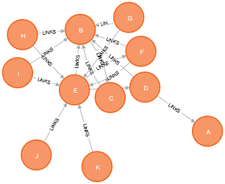

# Lab07 - Análise de Redes

Estrutura de pastas:

~~~
├── README.md  <- arquivo apresentando a tarefa
│
└── images   <- arquivos de imagem relacionadas a tarefa
~~~

## Tarefa de análises feitas no Cypher

## Exercício 1

Calcule o Pagerank do exemplo da Wikipedia em Cypher:

~~~cypher
LOAD CSV WITH HEADERS FROM 'https://raw.githubusercontent.com/santanche/lab2learn/master/network/pagerank/pagerank-wikipedia.csv' AS line
MERGE (p1:Page {name:line.source})
MERGE (p2:Page {name:line.target})
CREATE (p1)-[:LINKS]->(p2)
~~~
~~~cypher
CALL gds.graph.create(
  'prGraph',
  'Page',
  'LINKS'
)

CALL gds.pageRank.stream('prGraph')
YIELD nodeId, score
RETURN gds.util.asNode(nodeId).name AS name, score
ORDER BY score DESC, name ASC
~~~

## Exercício 2

Departing from a Drug-Drug graph created in a previous lab, whose relationship determines drugs taken together, apply a community detection in it to see the results:

~~~cypher
CALL gds.graph.create(
  'relGraph',
  'Drug',
  {
    Relates: {
      orientation: 'UNDIRECTED',
      properties: 'weight'
    }
  }
)
~~~

### Com pesos

~~~cypher
CALL gds.louvain.stream('relGraph',  {relationshipWeightProperty: 'weight'})
YIELD nodeId, communityId
RETURN gds.util.asNode(nodeId).name AS name, communityId
ORDER BY communityId ASC
~~~

### Sem pesos

~~~cypher
CALL gds.louvain.stream('relGraph')
YIELD nodeId, communityId
RETURN gds.util.asNode(nodeId).name AS name, communityId
ORDER BY communityId ASC
~~~
